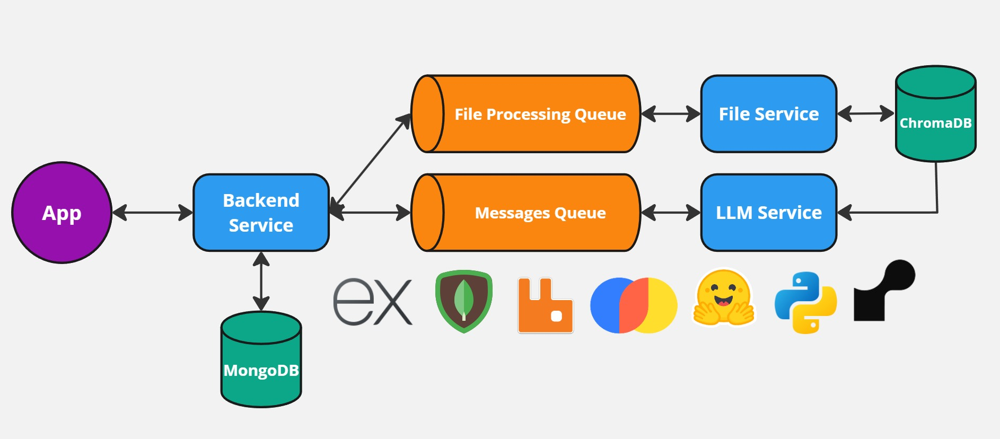
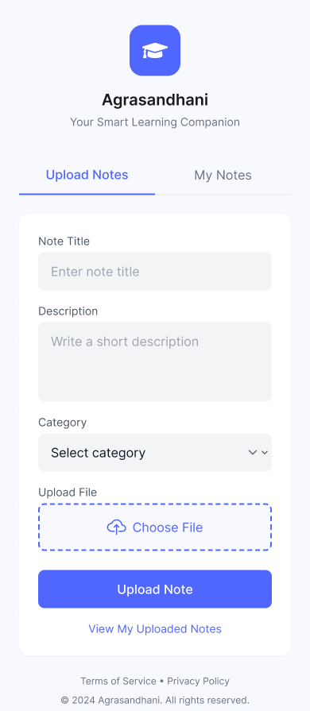
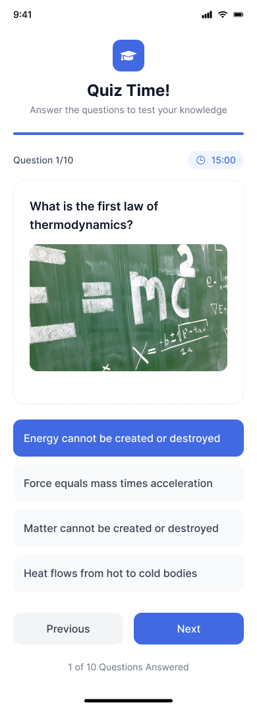

# Agrasandhani 2.0 📚✨

Transform your study notes into interactive quizzes and beautifully formatted equations using the power of LLMs.



## Features 🚀

- **Smart Quiz Generation**: Upload your notes and get AI-generated quizzes tailored to your content
- **LaTeX Equation Extraction**: Automatically converts handwritten or typed equations into LaTeX format
- **Engineering-Focused**: Specially designed for technical and engineering content
- **Interactive Testing**: Take generated quizzes and track your progress
- **Multi-Format Support**: Supports PDF, Images, and Text files

## Screenshots 📸




## How It Works 🔄

1. **Upload**: Share your study materials through our intuitive interface
2. **Process**: Our system processes your content through two pipelines:
   - Text and equation extraction
   - Quiz generation using advanced LLMs
3. **Practice**: Access generated quizzes and LaTeX equations
4. **Track**: Monitor your performance and identify areas for improvement

## Tech Stack 💻

- **Backend**: Express.js with MongoDB
- **Queue System**: RabbitMQ for file processing and message handling
- **LLM Integration**: Custom LLM service for quiz generation
- **File Processing**: Dedicated service for document handling
- **Database**: 
  - MongoDB for user data and content management
  - ChromaDB for vector storage
- **Security**: MongoDB Shield for enhanced data protection

## Getting Started 🏁

### Prerequisites

This section will be updated soon.

### Configuration

Update `.env` with your credentials:
```
MONGODB_URI=your_mongodb_uri
RABBITMQ_URL=your_rabbitmq_url
LLM_API_KEY=your_llm_api_key
```

### Running the Application

This section will be updated soon.

## Contributing 🤝

We welcome contributions! Please see our [Contributing Guidelines](CONTRIBUTING.md) for details.


## License 📝

This project is licensed under the MIT License - see the [LICENSE](LICENSE) file for details.

## Acknowledgments 👏

- MongoDB for database support
- RabbitMQ for queue management
- LaTeX community for equation processing standards

## Contact 📧

For support or queries, please open an issue or contact the maintainers.

---

Built with ❤️ by the Agrasandhani Team
